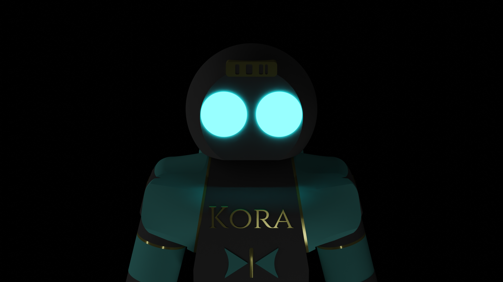

# Kora
 
ROS2 humanoid robot, intended for secure, offline use. This project is built off of my previous Tori robot (ROS Noetic) and many files still need to be edited for ROS2 Humble compatibility, cleaned up/commented, and migrated. 

## Compatibility

I'm developing Kora using: 

Ubuntu 22.04.3 64-bit

ROS2 Humble

IGN Gazebo 6.15.0 Fortress

## Usage

I'll have to do a lot of cleanup before this project functions properly. Here's basic usage for now to simulate the stationary model:

1. Place this repo into your Ros2 workspace's src folder

2. `cd ~/my_ros2_ws`

3. `colcon build`

4. `ros2 launch kora launch.py`

5. In a separate terminal, run `ros2 run rviz2 rviz2` to see the model

6. In a separate terminal, run `ign gazebo -v 4 kora_desc/kora.sdf` to start the simulation

Please note that this repo uses Dexter & Sinister to denote Right & Left respectively. This notation is consistent and unambiguous as it always refers to the robot's perspective, never the viewer.

## #TODO

-Migrate Noetic contents into ROS2

-Update joints/links to match current Kora iteration

-Make vision.py and custom Detectron2 compatible with current version of Detectron2 if no higher-performing library is available

-Retrain model to include initial input from VR human kinematic data

-Clean up to make files more human-readable

-Prepare missing files for upload, including VR compatibility, files/meshes from the older Tori robot (possibly in a separate repo) including from the real robot's Raspberry Pis and Jetson

## Hardware

-The Kora robot software & hardware are still heavily in development. I'm currently making the high-precision servos that will function as the robot's joints. Anti-backlash gears are expensive so manufacturing my own will be much more sustainable in the long-run.

-The Tori robot was primarily 3D printed (ugly & unprofessional) and it couldn't lift its leg because there was too much flex in the links. Kora will have a gorgeous resin exterior with internal support from appropriate metals, so rigidity and aesthetics won't be a problem.

-The Tori robot used a Jetson Xavier NX and I imagine that Kora will use at least the same. It also used two on-board Raspberry Pis but migrating to ESP32 would greatly increase efficiency, speed, and reliability while reducing cost and space required.

